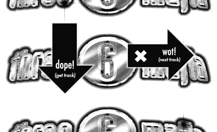
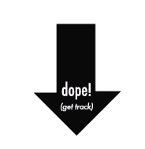
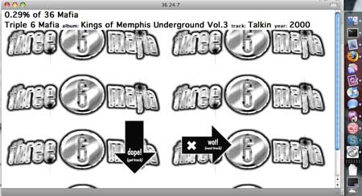

# 36 24 7 Research Documentation

## Original Project Overview

**Project Name:** 36 24 7 (Three 6 Mafia 24/7)
**Original URL:** https://fffff.at/36/
**Created By:** Theo Watson
**Released:** August 29, 2008
**Organization:** F.A.T. Lab (Free Art and Technology Lab)

### What It Was

The 36 24 7 player was a web-based audio player that served up random tracks from a massive collection of Three 6 Mafia and Hypnotize Minds discography. The name is a play on "Three 6 Mafia" (36) + "24/7" (playing constantly).

**Key Features:**
- **719 tracks** from the complete Three 6 Mafia Hypnotize Minds Discography
- **Auto-play on load** - a random song started immediately
- **Top info bar** displaying: Artist, Album, Track Name, Year (pulled from ID3 tags)
- **"Next" button** - skip to another random track
- **"Download" button** - save the current track as MP3
- **Progress tracking** - showed percentage of catalog listened to (persisted via cookies)
- **SoundManager2** for Flash-based audio playback (pre-HTML5 audio era)

### Screenshots


*The original 36 24 7 web interface*


*The "Next" button - styled with F.A.T.'s signature aesthetic*


*The "Download" button*


*Mac desktop app version created by Jamie Dubs using Fluid*

### Technical Implementation (Original)

```
Technology Stack:
- SoundManager2 (Flash-based audio before HTML5)
- Pure JavaScript (no frameworks)
- ID3 tag reading for metadata display
- Cookie-based progress persistence
- Static HTML hosted on fffff.at
- MP3 files served from FTP directory structure
```

The original used a hardcoded JavaScript array of 719 track paths pointing to an FTP server directory structure organized by album.

---

## F.A.T. Lab Philosophy & Aesthetic

### Core Mission
> "The Free Art and Technology (F.A.T.) Lab is an organization dedicated to enriching the public domain through the research and development of technologies and media. Release early, often and with rap music. This is Notorious R&D."

### Key Philosophical Principles

1. **Public Domain First**
   - All work released as "Copyfree and in the Public Domain"
   - "No rights reserved" - complete openness
   - Anti-copyright, pro-remix culture

2. **Anti-Establishment / Anti-Corporate Tech**
   - Projects like "FuckGoogle" criticizing surveillance capitalism
   - Skepticism toward corporate tech dominance
   - DIY/hacker ethos over polished commercial products

3. **Hip-Hop Culture Integration**
   - "Notorious R&D" - mixing tech with hip-hop sensibility
   - Music-focused projects like 36 24 7
   - Mixtape culture meets open source

4. **Rapid Prototyping**
   - "Release early, often" - ship fast, iterate publicly
   - Speed projects - build something in hours/days
   - Function over polish

5. **Accessible Technology**
   - Make tools available to everyone
   - No paywalls, no proprietary locks
   - Education through doing

### Visual Aesthetic

- **Raw/Unpolished** - intentionally rough, not corporate sleek
- **Black and white** with occasional accent colors
- **Graffiti/street art influence** (via Graffiti Research Lab connection)
- **Minimal UI** - stripped down to essentials
- **Bitmap graphics** - GIFs, simple PNGs, anti-retina
- **Monospace fonts** - terminal/hacker aesthetic

### Closure Context (2015)

F.A.T. Lab shut down in August 2015. From their farewell post:
> "The web has changed a lot in the last 8 years... Our adversaries have grown powerful and our methods outdated."

The closure reflected a consensus that "the war against the increased surveillance and commercialization of technology and the internet had been lost" - but the spirit lives on in archived work and community memory.

---

## Eyebeam Connection

F.A.T. Lab was deeply connected to **Eyebeam Art + Technology Center** in New York City (2005-2008 era).

### Eyebeam's Mission
> "Eyebeam invests in artists who create with technology and explore how it influences the way we live."

### Shared Values
- Artists shaping technology policy
- Questioning surveillance capitalism
- Radical, systemic change through art
- Shifting power imbalances
- Supporting emerging artists and technologists

### Key People
- **Evan Roth** - F.A.T. Lab co-founder, Eyebeam senior fellow
- **James Powderly** - F.A.T. Lab co-founder, Graffiti Research Lab
- **Theo Watson** - Created 36 24 7, openFrameworks developer
- **Jamie Dubs** - Created the Mac desktop app version

---

## Modern Redux: Design Principles

### What to Keep
- **Minimalist interface** - just the essentials
- **Random discovery** - no playlists, no algorithms, just chaos
- **Progress tracking** - gamification of listening
- **Information bar** - show what's playing (artist, album, track)
- **Raw aesthetic** - not polished, intentionally rough
- **Anti-surveillance ethos** - no tracking, no analytics, no data harvesting

### What to Change
- **No autoplay** - browsers block this now; use "Enter" button to start
- **No download** - streaming only to respect modern music landscape
- **HTML5 Audio API** - no more Flash/SoundManager2
- **S3 streaming** - serve files from AWS S3 instead of FTP
- **Responsive** - work on mobile (original was desktop-only)

### User Flow (Redux)

```
1. User lands on page
2. Sees "ENTER" button (referencing the original's instant-play but respecting autoplay restrictions)
3. Click Enter -> random track starts playing
4. Top bar shows: Artist | Album | Track | Year
5. Single button: "NEXT" (skip to random track)
6. Track ends -> automatically plays next random track
7. Progress percentage shown (optional)
```

---

## Technical Architecture (Modern)

### Frontend
- **Pure HTML/CSS/JS** - keeping it simple, no framework bloat
- **HTML5 Audio API** - native browser audio
- **Fetch API** - for loading track metadata
- **LocalStorage** - for progress persistence (replacing cookies)
- **Web Audio API** (optional) - for visualizations

### Backend Options

#### Option A: Serverless (Preferred)
```
S3 Bucket (audio files)
    │
    ├── CloudFront CDN (distribution)
    │       │
    │       └── Signed URLs or Referer restriction
    │
    └── Static website hosting (HTML/CSS/JS)
```

**Pros:**
- No server to maintain
- Scales infinitely
- Low cost
- Simple deployment

**Cons:**
- Limited ability to truly lock down files (determined users can extract URLs)
- No dynamic track listing without manifest file

#### Option B: Minimal API (If Locking Down Required)
```
S3 Bucket (private)
    │
    └── Lambda@Edge or API Gateway
            │
            └── Generate signed URLs with short expiry
            │
            └── CloudFront serves to client
```

**Pros:**
- Better access control
- Can rotate URLs
- Track analytics if desired

**Cons:**
- More complex
- Slightly higher latency
- Requires AWS API Gateway or Lambda

### S3 Security Considerations

For basic protection without a server:

1. **Referer-based policy** (weak but simple):
```json
{
  "Version": "2012-10-17",
  "Statement": [{
    "Effect": "Allow",
    "Principal": "*",
    "Action": "s3:GetObject",
    "Resource": "arn:aws:s3:::your-bucket/*",
    "Condition": {
      "StringLike": {
        "aws:Referer": ["https://yourdomain.com/*"]
      }
    }
  }]
}
```

2. **CloudFront with signed cookies** (better):
- Users get a signed cookie on page load
- CloudFront validates cookie before serving audio
- Still no server needed (can use Lambda@Edge for signing)

3. **Pre-signed URLs via API** (strongest):
- Requires small Lambda/API
- URLs expire after minutes
- Best for preventing sharing

### Manifest File Structure

Since we can't dynamically list S3 contents, use a JSON manifest:

```json
{
  "tracks": [
    {
      "path": "artist/album/track.mp3",
      "artist": "Artist Name",
      "album": "Album Name",
      "title": "Track Title",
      "year": 2008
    }
  ],
  "total": 719,
  "lastUpdated": "2024-01-01"
}
```

---

## Resources & References

### F.A.T. Lab Archive
- **GitHub Archive**: https://github.com/fatlab/fffff.at-archive
- **Original Site**: https://fffff.at (archived, no longer updated)
- **F.A.T. Manual**: Available as PDF in the archive

### Eyebeam
- **Website**: https://eyebeam.org
- **Rapid Response Program**: https://eyebeam.org/program/rapid-response/

### Technical
- **SoundManager2** (original): http://www.schillmania.com/projects/soundmanager2/
- **Web Audio API**: https://developer.mozilla.org/en-US/docs/Web/API/Web_Audio_API
- **AWS S3 Static Hosting**: https://docs.aws.amazon.com/AmazonS3/latest/userguide/WebsiteHosting.html

### Related F.A.T. Projects
- **Graffiti Research Lab**: https://graffitiresearchlab.com
- **openFrameworks**: https://openframeworks.cc (Theo Watson's main project)

---

## Archive Files Included

This research was compiled from the cloned F.A.T. Lab archive repository:

```
fffff.at-archive/
├── archive/
│   ├── 36/                    # Original player files
│   │   ├── index.html         # Complete player with track list
│   │   ├── 36-like-sm-bw-dn2.png  # Download button
│   │   └── 36-wot-sm-bw-cn.png    # Next button
│   ├── 36-24-7/               # Blog post about the project
│   ├── 36-desktop-player/     # Desktop app announcement
│   └── files/
│       ├── 2008/08/picture-2.png  # Interface screenshot
│       ├── 36-desktop-player_sm.jpg
│       └── 36.app-screenshot_sm.jpg
└── README.md                  # Archive documentation
```

---

*Research compiled for 36247 Redux project, February 2024*
*Continuing the F.A.T. Lab spirit: Release early, often, and with rap music.*
